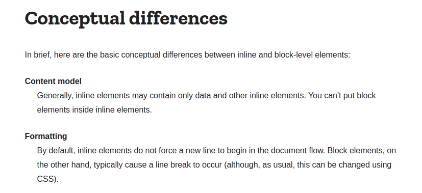
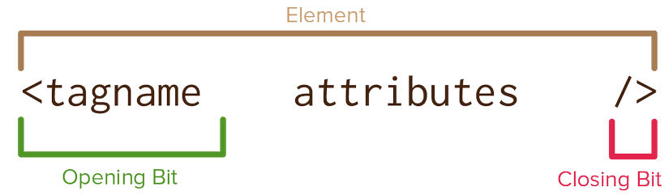
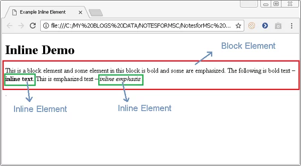
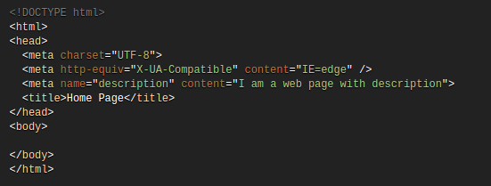

# Series Câu hỏi phỏng vấn HTML - [HTML Interview Questions] - phần 1

Có rất nhiều cách để chúng ta có thể học, tiếp thu kiến thức trong ngành IT này. Ví dụ đọc sách, xem video tutorial, đọc blog ...v.v. và học từ những câu hỏi phỏng vấn cũng là cách để chúng ta có thể kiểm tra được kiến thức hiện tại của mình, cũng như mở rộng kiến thức ở những phần mình chưa biết, chưa nắm chắc. Thỉnh thoảng mình cũng lên mạng để hóng mấy câu hỏi phỏng vấn kiểu này để bổ sung kiến thức :v Xem để học hỏi chứ không phải chuẩn bị để nghỉ việc nhé các brooo hahah. Đó là lý do tại sao mình bắt đầu tổng hợp trong series này.

À quên chưa giới thiệu, chào mọi người, mình là Tiến 😅

Series này sẽ là 55 câu hỏi phỏng vấn HTML mình lượm nhặt tổng hợp trên mạng, bạn có thể tham khảo để cover lại kiến thức nhé. Dự sau sẽ có cả `55 câu hỏi phỏng vấn CSS, 55 câu hỏi phỏng vấn JS, 55 câu hỏi phỏng vấn ABC, XYZ ...` Việc của bạn là like và lưu bài viết để ủng hộ mình, nếu mọi người ủng hộ nhiệt tình. Mình sẽ cố gắng tổng hợp để có các series tiếp theo ❤️

Hơi lan man dài dòng nhỉ :v Giờ thì bắt đầu thôi.

**1. iframe trong HTML là gì? Và cách nó hoạt động?**

___

- iframe là một thẻ trong HTML, thẻ này sẽ giúp chúng ta có thể nhúng nội dung tài liệu khác vào trong tài liệu HTML.

    Ví dụ:

    `<iframe src="[https://github.com](https://github.com/)" height="300px" width="300px"></iframe>`

**2. Giải thích về thẻ meta trong HTML?**

___

Có 1 vài điểm chúng ta cần lưu ý về thẻ meta trong HTML như sau

1. Thẻ meta luôn được đặt trong thẻ `head` ở đầu trang HTML.
2. Thẻ meta sẽ không hiển thị trên trang nhưng có thể sử dụng **ispect** trên trình duyệt để xem nội dung
3. Thẻ meta có thể chứa thông tin về `character encoding, description, title`
4. Thẻ meta sẽ cung cấp thông tin cho các công cụ tìm kiếm. VD như Search Engine của Google

Ví dụ

```
<!DOCTYPE html>
<html>
    <head>
    <meta name="description" content="I am a web page with description">
    <title>Home Page</title>
    </head>
    <body>
    </body>
</html>
```

**3. Thuộc tính alt của hình ảnh có ý nghĩa gì?**

_____

- Thuộc tính alt sẽ cung cấp thông tin thay thế cho một hình ảnh trong trường hợp user không thể xem nó(do kết nối chậm, lỗi trong thuộc tính src..v.v)
- Thuộc tính alt nên được sử dụng để mô tả bất kỳ hình ảnh nào ngoại trừ những hình ảnh chỉ phục vụ mục đích trang trí, trong trường hợp đó, nó nên được để trống.

**4. Sự khác nhau giữa thẻ span và thẻ div?**

_____

- `div` là một block element
- `span` là một inline element

Bổ sung, về cơ bản việc để một block element bên trong một inline element có vẻ không hợp lý. 

Ví dụ: Trong khi thẻ div có thể có thẻ p và thẻ p có thẻ span bên trong. Tuy nhiên việc để thẻ div hoặc thẻ p bên trong 1 thẻ span có vẻ không hợp lý. Tất nhiên bạn vẫn có thể sử dụng, nhưng đây như là một convention bạn nên theo. 

Dưới đây là giải thích của trang [developer mozilla](https://developer.mozilla.org/en-US/docs/Web/HTML/Inline_elements) cho vấn đề này



**5. Làm thế nào để Search Engines có thể tìm kiếm chỉ mục(index) tốt hơn?**

---

- Bạn có thể đánh index tốt hơn bằng cách sử dụng 2 lệnh sau trong phần `<HEAD>` của tài liệu HTML của bạn.

```
<META NAME="keywords" CONTENT="keyword keyword keyword keyword">
<META NAME="description" CONTENT="description of your site">
```

- Cả 2 đều chứa tối đa 1022 ký tự. Nếu một từ khóa được sử dụng nhiều hơn 7 lần, keywords tag sẽ bị bỏ qua hoàn toàn.

**6. Một vài concept về HTML5?**

---

- HTML5 được thiết kế để thay thế HTML4, XHTML và HTML DOM Level 2. Một vài có thể kể đến như:
    1. Cung cấp nội dung phong phú(graphics, movies, audio, .etc..) mà không cần bổ sung thêm plugins, chẳng hạn như Flash.
    2. Cung cấp các thẻ sematic support tốt hơn cho cấu trúc trang web.
    3. Cung cấp hỗ trợ đa nền tảng tốt hơn cho dù chạy trên PC, tablet hoặc smartphone.

**7. Làm thế nào để highlight text trong HTML?**

---

- Nếu bạn làm việc với HTML5, hãy sử dụng `<mark>` tag để highlight text một cách dễ dàng và nhanh chóng.

    `<mark>highlighted text</mark>`

- Nếu chỉ sử dụng HTML, thì bạn có thể set background-color cho thẻ. Như ví dụ dưới đây

    `<span style="background-color: #FFFF00">Yellow text.</span>`

**8. Giải thích ý nghĩa một về các thẻ sematic trong HTML5: `<header>, <article>, <section>, <footer>`**

---

1. `<header>`: Được sử dụng để xác định phần đầu của một trang tài liệu hay phần đầu của một đoạn. Phần tử  `<header>` nên được sử dụng như một containter chứa nội dung giới thiệu hoặc mở đầu.
2. `<article>`: được sử dụng cho các nội dung độc lập và chứa nội dung của riêng nó. Nội dung bên trong phần tử `<article>` có ý nghĩa riêng biệt và có thể độc lập với các nội dung khác của trang web.
3. `<section>`: Phần tử  `<section>` xác định một phần có trong tài liệu. Dựa theo tài liệu về HTML5 của W3C thì: “Một section là một nhóm các nội dung giống nhau có cùng chủ đề.”
4. `<footer>`: Phần tử  `<footer>` xác định phần cuối của một trang tài liệu hay phần cuối của một đoạn. Phần tử  `<footer>` nên chứa thông tin như thông tin về tác giả, thông tin bản quyền, liên kết kết tới điều khoản sử dụng, thông tin liên hệ…


**9. Character Encoding là gì?**

---

- Để hiển thị trang HTML một cách chính xách, trình duyệt web phải biết bộ ký tự nào(character encoding) được sử dụng. Điều này sẽ chỉ định trong thẻ meta.

    HTML4:

    `<meta http-equiv="Content-Type" content="text/html;charset=ISO-8859-1">`

    HTML5:

    `<meta charset="UTF-8">`

**10. Thẻ tự đóng trong HTML5(self closing tag)?**

---

- Câu chuyện về thẻ tự đóng không mấy thú vị khi bạn chưa quan tâm tới nó. Thẻ tự đóng có liên quan đến những cách mà HTML đã được phát triển trong suốt quá trình sử dụng từ cuối những năm 1980. Thẻ HTML thông thường có thẻ mở và thẻ đóng như bạn đã biết. Tuy nhiên, có các phần tử trong HTML được gọi là các phần tử void, chẳng hạn như hình ảnh và liên kết, không yêu cầu nghiêm ngặt các thẻ đóng vì cấu trúc vốn có của chúng. Và chắc là như thế nên các chuyên gia cho rằng những thứ như hình ảnh và liên kết không cần và không thể có nội dung - chúng chỉ là loại con trỏ đến một yếu tố được cài đặt trong trang.



Một số thẻ tự đóng bạn có thể tham khảo: `<area>, <br>, <col>, <hr>, ` ...ec..., ngoài ra còn rất nhiều thẻ khác mình không tiện liệt kê hết. Bạn có thể xem thêm ở [đây](http://xahlee.info/js/html5_non-closing_tag.html) nhé.

**11. Sự khác biệt giữa `attribute` và `property` trong HTML?**

---

- **attribute** sẽ được định nghĩa trong thẻ HTML còn **property** sẽ được định nghĩa trong DOM. Lấy ví dụ chúng ta có 1 thẻ như sau: `<input type="text" value="Hello">`

```
const input = document.querySelector('input');
console.log(input.getAttribute('value')); // Hello
console.log(input.value); // Hello
```

Sau khi chúng ta thêm giá trị của text field bằng cách thêm "World!". Nó sẽ trở thành như sau

```
console.log(input.getAttribute('value')); // Hello
console.log(input.value); // Hello World!
```

**12. Khi nào thì sử dụng thẻ `small`?**

---

- Thẻ small làm cho kích thước front size nhỏ hơn một cỡ(Ví dụ: Từ lớn đến trung bình hoặc nhỏ) xuống cỡ phông chữ tối thiểu của trình duyệt. Trong HTML5, phần tử này sử dụng để thể hiện các bình luận bên lề và bản in nhỏ. Hoặc đơn giản nhất bạn có thể thấy là bản quyền(copyright) ở dưới footer.

```

<small>The copyright of this image is owned by Aurelio De Rosa</small>
```

**13. Sự khác nhau giữa block element và inline eement?**

---

- `block element` là những phần tử sẽ chiếm toàn bộ chiều rộng có sẵ trên một trang web, chặn hiệu quả bất kỳ phần tử nào khác ở bên trái hoặc bên phải.
- `inline element` là những phần tử chỉ chiếm chiều rộng cần thiết để hiển thị nội dung(content) của phần tử. Do đó cho phép các phần tử inline khác có thể cùng trên 1 dòng.




Một vài `block element` phổ biến như:

1. Paragraphs (`<p>`)
2. Headers (`<h1>` through `<h6>`)
3. Divisions (`<div>`)
4. Lists and list items (`<ol>`, `<ul>`, and `<li>`)
5. Forms (`<form>`)

Một vài `inline element` phổ biến như:

1. Spans (`<span>`)
2. Images (``)
3. Anchors (`<a>`)

**14. Giải thích về standard, full standard and quirks mode.**

---

- Quay lại thuở khai sơ các trang web thường được viết bằng hai version: Một cho Netscape Navigator và một cho Internet Expoler. Khi W3C khai sáng tạo ra **standard** thì các trang web không thể sử dụng chúng, vì như vậy sẽ làm vỡ hầu hết các trang web hiện có. Do đó, các trình duyệt đã giới thiệu 2 tiêu chuẩn để phù hợp với trang web mới và cũ. Bây giờ thì nó có 3 chế độ: `quirks mode, standards mode, và full standards`
- Đối với HTML, browser sẽ sử dụng DOCTYPE ở đầu page để quyết định xem nên xử lý nó ở chế độ nào. Bạn có thể tham khảo đoạn code ở dưới.

```
<!DOCTYPE html>
<html lang="en">
		<head>
		<meta charset=UTF-8>
		<title>Hello World!</title>
	</head>
	<body>
	</body>
</html>
```

Bạn có thể tìm hiểu thêm tại [đây](https://developer.mozilla.org/en-US/docs/Web/HTML/Quirks_Mode_and_Standards_Mode#how_does_mozilla_determine_which_mode_to_use.3f)

**15. Làm thế nào để set mode phù hợp với IE(Internet Explorer)?**

---

- Sử dụng **http-equiv=X-UA-Compatible** meta với content **IE=edge**
- **IE=edge** sẽ nói với IE hiển thị nội dung mới mode cao nhất hiện tại.

Bạn có thể tham khảo hình dưới




Phần 1 tạm thời thế đã 😅

Hãy comment nếu bạn cảm thấy bài viết này hữu ích và đừng quên để lại ý kiến để chúng ta cùng thảo luận nhé <3

**Thank you for reading and see you next posts <3**